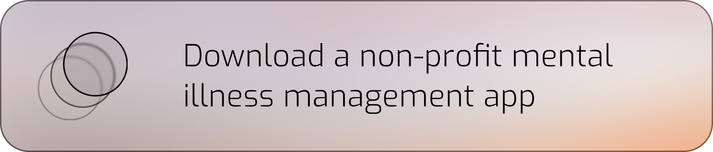
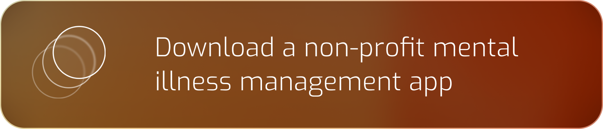
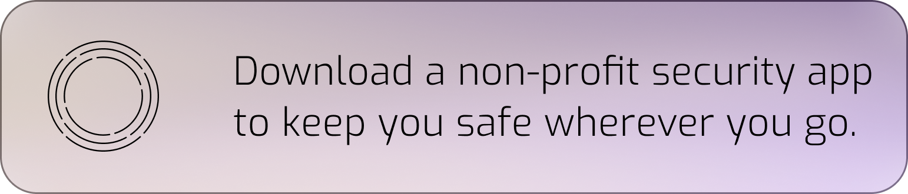
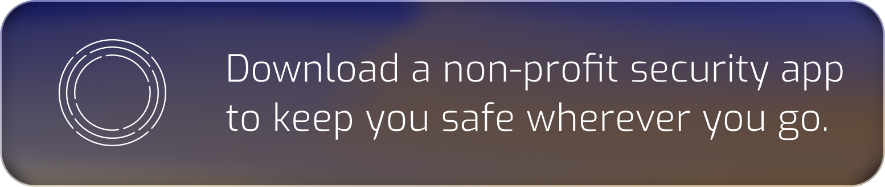
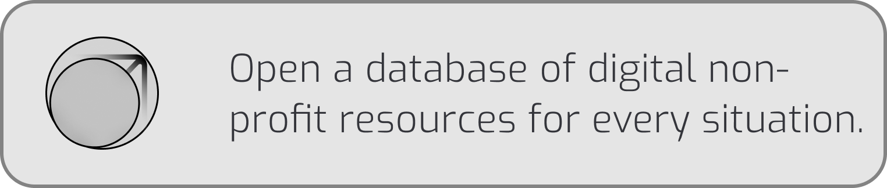
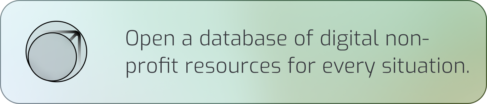
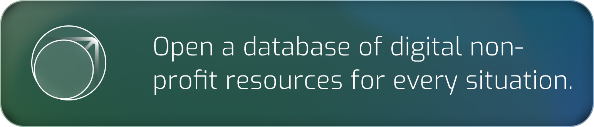

# Resource-Embeds
A repository of HTML embeds for you to link to Astra's resources. 

## Aetheria 
#### Light Mode - Transparent

```
<a href='https://withaetheria.org/'></a>
```
#### Light Mode - Gradient

```
<a href='https://withaetheria.org/'></a>
```
#### Dark Mode - Transparent

```
<a href='https://withaetheria.org/'></a>
```
#### Dark Mode - Gradient

```
<a href='https://withaetheria.org/'></a>
```

## Verena 
#### Light Mode - Transparent

```
<a href='https://withverena.org/'></a>
```
#### Light Mode - Gradient

```
<a href='https://withverena.org/'></a>
```
#### Dark Mode - Transparent

```
<a href='https://withverena.org/'></a>
```
#### Dark Mode - Gradient

```
<a href='https://withverena.org/'></a>
```

## Everine 
#### Light Mode - Transparent

```
<a href='https://witheverine.org'></a>
```

#### Light Mode - Gradient

```
<a href='http://witheverine.org'></a>
```

#### Dark Mode - Transparent

```
<a href='https://witheverine.org'></a>
```

#### Dark Mode - Gradient

```
<a href='http://witheverine.org'></a>
```
